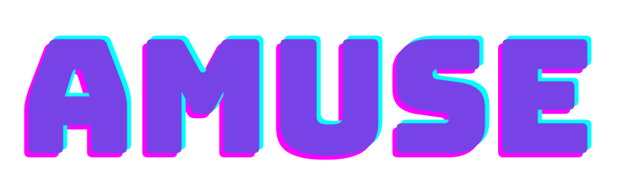

<p align="center">
  
</p>

---

<p align="center">
<a href="https://www.kth.se/profile/chhatre"><strong>Kiran Chhatre</strong></a>
·
    <a href="https://ps.is.tuebingen.mpg.de/person/rdanecek"><strong>Radek Daněček</strong></a>    
    ·
    <a href="https://ps.is.mpg.de/person/nathanasiou"><strong>Nikos Athanasiou</strong></a>
    <br>
    <a href="https://ps.is.mpg.de/person/gbecherini"><strong>Giorgio Becherini</strong></a>
    ·
    <a href="https://www.kth.se/profile/chpeters"><strong>Christopher Peters</strong></a>
    ·
    <a href="https://ps.is.tuebingen.mpg.de/person/black"><strong>Michael J. Black</strong></a>
    ·
    <a href="https://sites.google.com/site/bolkartt"><strong>Timo Bolkart</strong></a>
  </p>

<p align="center">
  <br>
  <a href='https://amuse.is.tue.mpg.de/' style='padding-left: 0.5rem;'>
      
    </a>
     <a href='https://arxiv.org/abs/2312.04466'>
      
    </a>
    <a href='https://youtu.be/gsEt9qtR1jk' style='padding-left: 0.5rem;'>
      
    </a>
    <a href='https://drive.google.com/file/d/1-FRWKlW9fr5y-lrija4E12gnm_A13MzN/view?usp=sharing' style='padding-left: 0.5rem;'>
  
</a>
  </p>
</p>
<br/>

<p align="center">
  
</p>


<br/>

This is a repository for **AMUSE**: Emotional Speech-driven 3D Body Animation via Disentangled Latent Diffusion. AMUSE generates realistic emotional 3D body gestures directly from a speech sequence (*top*). It provides user control over the generated emotion by combining the driving speech with a different emotional audio (*bottom*).
<br/> 

## News :triangular_flag_on_post:

- [2024/06/12] Code is available. 
- [2024/02/27] AMUSE has been accepted for CVPR 2024! Working on code release.
- [2023/12/08] <a href="https://arxiv.org/abs/2312.04466">ArXiv</a> is available.

---

## Setup

### Main Repo Setup

```bash
git clone https://github.com/kiranchhatre/amuse.git
cd amuse/dm/utils/
git clone https://github.com/kiranchhatre/sk2torch.git
git clone -b init https://github.com/kiranchhatre/PyMO.git
cd ../..
git submodule update --remote --merge --init --recursive
git submodule sync

git submodule add https://github.com/kiranchhatre/sk2torch.git dm/utils/sk2torch
git submodule add -b init https://github.com/kiranchhatre/PyMO.git dm/utils/PyMO

git submodule update --init --recursive

git add .gitmodules dm/utils/sk2torch dm/utils/PyMO
```

### Environment Setup

```bash
conda create -n amuse python=3.8
conda activate amuse
export CUDA_HOME=/is/software/nvidia/cuda-11.3
conda install pytorch==1.12.1 torchvision==0.13.1 torchaudio==0.12.1 cudatoolkit=11.3 -c pytorch
conda env update --file amuse.yml --prune
module load cuda/11.3
conda install anaconda::gxx_linux-64 # install 11.2.0
FORCE_CUDA=1 pip install --no-index --no-cache-dir pytorch3d -f https://dl.fbaipublicfiles.com/pytorch3d/packaging/wheels/py38_cu113_pyt1110/download.html
```

### Blender Setup

```bash
conda deactivate
conda env create -f blender.yaml
AMUSEPATH=$(pwd)
cd ~
wget https://download.blender.org/release/Blender3.4/blender-3.4.1-linux-x64.tar.xz
tar -xvf ./blender-3.4.1-linux-x64.tar.xz
cd ~/blender-3.4.1-linux-x64/3.4
mv python/ _python/
ln -s /home/kchhatre/anaconda3/envs/envs/blender ./python
cd "$AMUSEPATH"
cd scripts
conda activate amuse
```


---


## Data Setup and Blender Resources

Follow instructions: [https://amuse.is.tue.mpg.de/download.php](https://amuse.is.tue.mpg.de/download.php)


---


## Tasks

Once the above setup is correctly done, you can execute the following:

- [x] **train_audio (training step 1/2)**  
  Train AMUSE step 1 of the speech disentanglement model.
  ```bash
  cd $AMUSEPATH/scripts
  python main.py --fn train_audio
  ```

- [x] **train_gesture (training step 2/2)**  
  Train AMUSE step 2 of the gesture generation model.
  ```bash
  cd $AMUSEPATH/scripts
  python main.py --fn train_gesture
  ```

- [x] **infer_gesture**  
  Infer AMUSE on a single 10s WAV monologue audio sequence.  
  Place audio in `$AMUSEPATH/viz_dump/test/speech`.  
  Video of generated gesture will be in `$AMUSEPATH/viz_dump/test/gesture`.
  ```bash
  cd $AMUSEPATH/scripts
  python main.py --fn infer_gesture
  ```

- [ ] **edit_gesture**  
  COMING SOON
  ```bash
  cd $AMUSEPATH/scripts
  python main.py --fn infer_gesture
  ```

- [x] **bvh2smplx_**  
  Convert BVH to SMPLX (only with provided BMAP presets from AMUSE website download page if possible).  
  Highly experimental, no support.
  Place BVH file inside `$AMUSEPATH/data/beat-rawdata-eng/beat_rawdata_english/<<actor_id>>`, where actor_id is between 1 and 30. The converted file will be in `$AMUSEPATH/viz_dump/smplx_conversions`.
  ```bash
  cd $AMUSEPATH/scripts
  python main.py --fn bvh2smplx_
  ```
  Once converted, import the file in Blender using the SMPLX blender addon. Remember to specify the target FPS (for current file: 24 FPS) in the import animation window while importing the NPZ file.

<p align="center">
  
</p>

- [ ] **prepare_data**  
  Train AMUSE on BEAT 0.2.1 or BEAT-X or custom dataset.
  COMING SOON: Conversion script, dataloader LMDB file creation.
  ```bash
  cd $AMUSEPATH/scripts
  python main.py --fn prepare_data
  ```

- [ ] **other**  
  COMING SOON
  ```bash
  ```


---

## Citation

```bibtex
@InProceedings{Chhatre_2024_CVPR,
    author    = {Chhatre, Kiran and Daněček, Radek and Athanasiou, Nikos and Becherini, Giorgio and Peters, Christopher and Black, Michael J. and Bolkart, Timo},
    title     = {{AMUSE}: Emotional Speech-driven {3D} Body Animation via Disentangled Latent Diffusion},
    booktitle = {Proceedings of the IEEE/CVF Conference on Computer Vision and Pattern Recognition (CVPR)},
    month     = {June},
    year      = {2024},
    pages     = {1942-1953},
    url = {https://amuse.is.tue.mpg.de},
}
```

<br/>

## Contact

For any inquiries, please feel free to contact [amuse@tue.mpg.de](mailto:amuse@tue.mpg.de). Feel free to use this project and contribute to its improvement.
